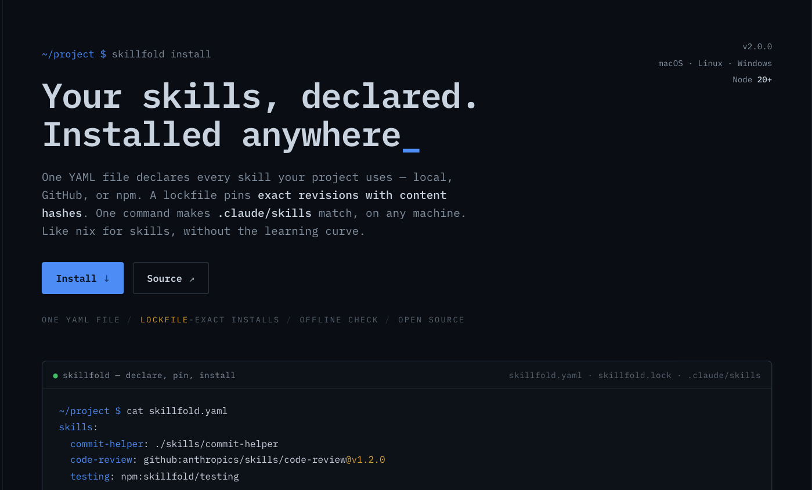
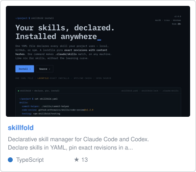
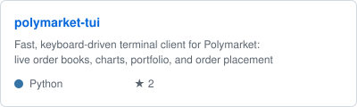
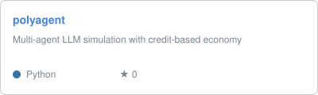

# Hey, I'm Byron

AI engineer based in Auckland, New Zealand. I build agent pipelines, data platforms, and the occasional terminal app.

## Projects

<!-- projects:start -->

All public projects

| Project | Description | Language | Stars |
| --- | --- | --- | --- |
| [skillfold](https://github.com/byronxlg/skillfold) ([site](https://byronxlg.github.io/skillfold/)) | Configuration language and compiler for multi-agent AI pipelines. Compiles YAML config into standard SKILL.md files. | TypeScript | 11 |
| [polymarket-tui](https://github.com/byronxlg/polymarket-tui) ([site](https://byronxlg.github.io/polymarket-tui/)) | Fast, keyboard-driven terminal client for Polymarket: live order books, charts, portfolio, and order placement | Python | 2 |
| [dotfiles](https://github.com/byronxlg/dotfiles) |  | Python | 1 |
| [MMM-AT-Bus](https://github.com/byronxlg/MMM-AT-Bus) |  | JavaScript | 1 |
| [homebrew-tap](https://github.com/byronxlg/homebrew-tap) | Homebrew tap for Byron's tools (polymarket-tui, ...) | Python | 0 |
| [polyagent](https://github.com/byronxlg/polyagent) | Multi-agent LLM simulation with credit-based economy | Python | 0 |
| [skills](https://github.com/byronxlg/skills) | A collection of Claude Code skills by byronxlg | - | 0 |
| [causeflow](https://github.com/byronxlg/causeflow) | Appwrite Sites Hackathon 2025 Submission | TypeScript | 0 |
| [Travel_ARIMA_Analysis](https://github.com/byronxlg/Travel_ARIMA_Analysis) |  | - | 0 |
| [DATA301_Project](https://github.com/byronxlg/DATA301_Project) | DATA301 Group Project | - | 0 |

<!-- projects:end -->

## What I work with

- **AI & Agents** - Python, LangGraph, MLflow, RAG, text-to-SQL
- **Cloud & Data** - Azure, Snowflake, Databricks
- **Full Stack** - React, FastAPI, PostgreSQL
- **Infrastructure** - Terraform, CI/CD (Azure DevOps, GitHub Actions)

The projects section is regenerated daily from the GitHub API by [a workflow](.github/workflows/update-projects.yml) in this repo.
