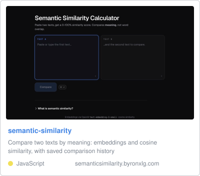

# Hey, I'm Byron

AI engineer based in Auckland, New Zealand. I build agent pipelines, data platforms, and the occasional terminal app.

## What I work with

- **AI & Agents** - Python, LangGraph, MLflow, RAG, text-to-SQL
- **Cloud & Data** - Azure, Snowflake, Databricks
- **Full Stack** - React, FastAPI, PostgreSQL
- **Infrastructure** - Terraform, CI/CD (Azure DevOps, GitHub Actions)
- **Certified** - Databricks GenAI Engineer Associate, SnowPro Core, Azure Data Engineer Associate

## Projects

<!-- projects:start -->

### All public projects

| Project | Description | Language | Stars |
| --- | --- | --- | --- |
| [skillfold](https://github.com/byronxlg/skillfold) ([site](https://byronxlg.github.io/skillfold/)) | Declarative skill manager for Claude Code and Codex. Declare skills in YAML, pin exact revisions in a lockfile, install them reproducibly into .claude/skills. |  |  |
| [polymarket-tui](https://github.com/byronxlg/polymarket-tui) ([site](https://byronxlg.github.io/polymarket-tui/)) | Fast, keyboard-driven terminal client for Polymarket: live order books, charts, portfolio, and order placement |  |  |
| [dotfiles](https://github.com/byronxlg/dotfiles) |  |  |  |
| [MMM-AT-Bus](https://github.com/byronxlg/MMM-AT-Bus) |  |  |  |
| [homebrew-tap](https://github.com/byronxlg/homebrew-tap) | Homebrew tap for Byron's tools (polymarket-tui, ...) |  |  |
| [botsmith](https://github.com/byronxlg/botsmith) | botsmith.dev - small, sharp software from Auckland; websites for NZ small businesses |  |  |
| [gecko-home-garden](https://github.com/byronxlg/gecko-home-garden) | Preview site for Gecko Home & Garden Services, built by botsmith |  |  |
| [greenaid-gardening](https://github.com/byronxlg/greenaid-gardening) | Preview site for GreenAid Gardening, built by botsmith |  |  |
| [mobile-vehicle-maintenance](https://github.com/byronxlg/mobile-vehicle-maintenance) | Preview site for Mobile Vehicle Maintenance, built by botsmith |  |  |
| [a1-property-revival](https://github.com/byronxlg/a1-property-revival) | A1 Property Maintenance Revival, Auckland - preview site by botsmith |  |  |
| [kanes-mowing](https://github.com/byronxlg/kanes-mowing) | Kanes Mowing LTD, South Auckland - preview site by botsmith |  |  |
| [shorewash](https://github.com/byronxlg/shorewash) | shorewash.co.nz - exterior cleaning, North Shore Auckland |  |  |
| [skills](https://github.com/byronxlg/skills) | A collection of Claude Code skills by byronxlg |  |  |
| [solar-system](https://github.com/byronxlg/solar-system) | A solar system you fly through with your hands |  |  |
| [polyagent](https://github.com/byronxlg/polyagent) | Multi-agent LLM simulation with credit-based economy |  |  |
| [causeflow](https://github.com/byronxlg/causeflow) | Appwrite Sites Hackathon 2025 Submission |  |  |
| [Travel_ARIMA_Analysis](https://github.com/byronxlg/Travel_ARIMA_Analysis) |  |  |  |
| [DATA301_Project](https://github.com/byronxlg/DATA301_Project) | DATA301 Group Project |  |  |
<!-- projects:end -->
